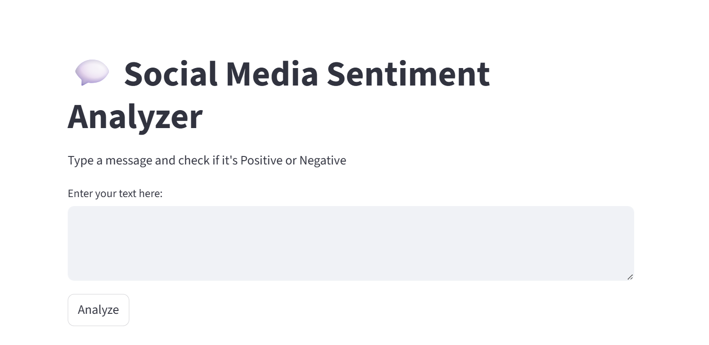
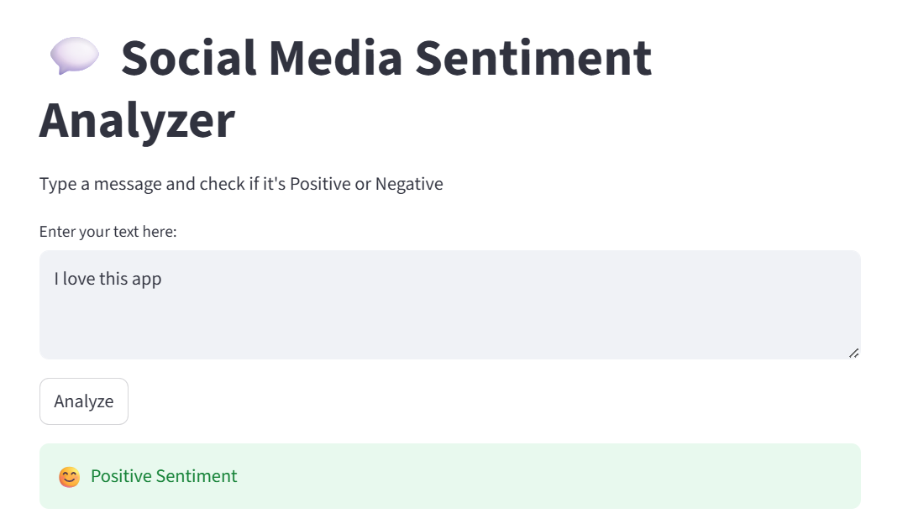
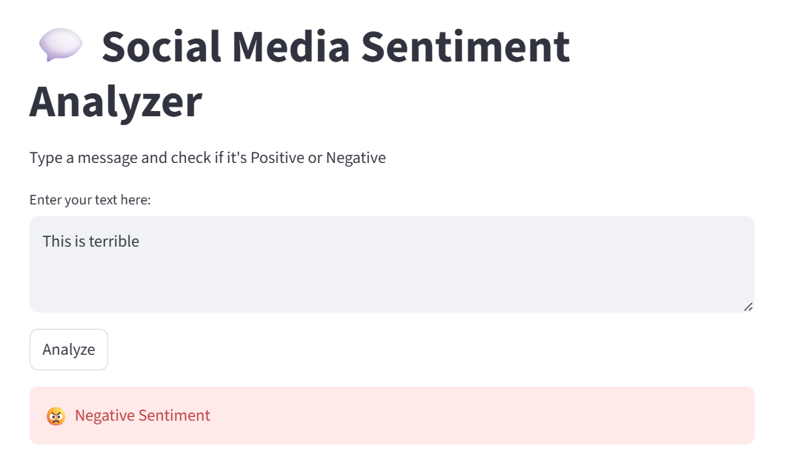

## 💬 Social Media Sentiment Analysis

## 📌 Project Overview
A Machine Learning-powered web application that analyzes social media text and classifies sentiment as Positive 😊 or Negative 😡.
This project demonstrates the use of Natural Language Processing (NLP) and Machine Learning to understand public opinion from user-generated content like tweets, comments, and reviews.

## 🚀 Features
- 🔍 Real-time sentiment prediction
- 🧠 Machine Learning model (Logistic Regression)
- 🧹 Text preprocessing using NLP techniques
- 🌐 Interactive UI using Streamlit
- ⚡ Fast and simple predictions

## 🛠️ Tech Stack
- Python 🐍
- Pandas
- Scikit-learn
- NLTK
- Streamlit
  
## 📂 Project Structure

```
Social-Media-Sentiment-Analysis/
│
├── data/
├── notebooks/
├── src/
│   ├── preprocess.py
│   ├── train.py
│
├── app/
│   └── app.py
│
├── models/
├── outputs/
├── images/
├── main.py
├── requirements.txt
└── README.md
```


## 📸 Screenshots

### 🟢 Home Page


### 😊 Positive Sentiment


### 😡 Negative Sentiment


## ⚙️ Installation
git clone https://github.com/needhi-x/Social-Media-Sentiment-Analysis.git
cd Social-Media-Sentiment-Analysis

python -m venv venv

venv\Scripts\activate

pip install -r requirements.txt


## ▶️ Run the App

streamlit run app/app.py


## 📊 Example

| Input Text        | Prediction     |
|------------------|---------------|
| I love this app  | Positive 😊   |
| This is terrible | Negative 😡   |


## 🎯 Future Improvements
- Add Neutral sentiment
- Use Deep Learning (LSTM/BERT)
- Deploy on cloud

## 👩‍💻 Author

Nidhi Apotikar

📌 GitHub: https://github.com/needhi-x

## ⭐ Support

If you like this project, give it a ⭐ on GitHub!

## 📬 Contact

Feel free to connect for collaborations or opportunities 🚀
